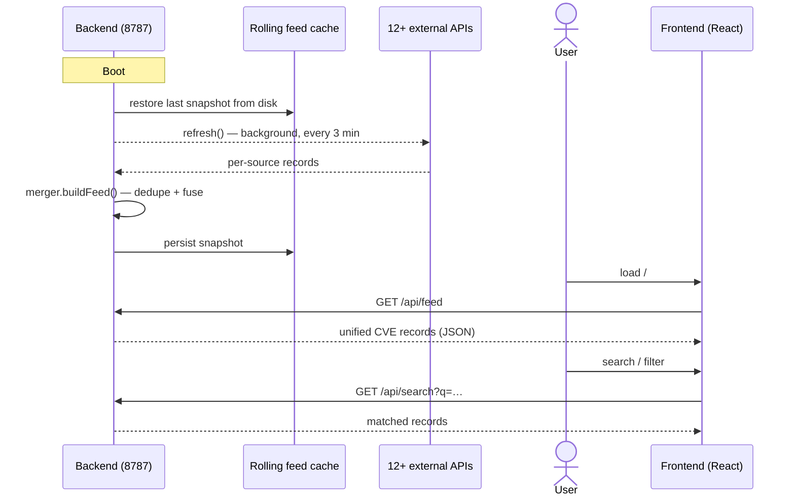

# CTI (CVE Threat Intelligence)

> A self-hosted vulnerability intelligence dashboard that fuses **12+ open CVE feeds** into a single live SOC console.

CTI is not just another CVE viewer. It is a small, opinionated SOC workstation you can run entirely on your own infrastructure: no SaaS, no data egress, no telemetry. The backend continuously cross-references public threat-intel sources and the frontend visualises that fused stream as a tactical dashboard.

---

## Table of contents

1. [Why this dashboard is different](#why-this-dashboard-is-different)
2. [Architecture](#architecture)
3. [Data sources](#data-sources)
4. [Feature tour](#feature-tour)
5. [Getting started](#getting-started)
6. [Login & credentials](#login--credentials)
7. [API key setup](#api-key-setup)
8. [Configuration](#configuration)
9. [Project layout](#project-layout)
10. [Security & privacy](#security--privacy)
11. [Roadmap](#roadmap)

---

## Why this dashboard is different

Most CVE dashboards are thin wrappers around a single source (usually just NVD). They tell you a CVE exists. They do **not** tell you whether anyone has weaponised it, where the PoC lives, or what to actually do about it tonight.

CTI is built around three ideas that, together, no other open dashboard ships out of the box:

| # | Idea | What it means in practice |
|---|------|---------------------------|
| 1 | **Fusion, not aggregation** | The merger normalises CVEs from NVD, MITRE, CISA KEV, OSV, EPSS, Exploit-DB, Nuclei, InTheWild, Trickest, GitHub PoC index, OSS-Security, Red Hat, and Ubuntu USN into one shared schema. A single record carries CVSS + EPSS + KEV flag + ITW sightings + PoC repos + Nuclei templates side-by-side. |
| 2 | **"What changed?" signals, not just dates** | The Zero-Day & PoC panel surfaces **why** an entry is interesting right now: new PoC repos in the last 14 days, KEV additions in the last 30, fresh ITW reports, or recent disclosures — colour-coded and ranked. No more squinting at modified-date timestamps. |
| 3 | **Zero ops** | The whole rolling feed lives on disk as a single JSON cache (`server/.cache/`), restored on boot, refreshed every 3 minutes in the background. No database server, no login, no multi-tenant overhead. |

---

## Architecture

```mermaid
flowchart LR
    subgraph EXT["Public threat-intel sources"]
        NVD["NVD (CVE master)"]
        MITRE["MITRE CVE List"]
        KEV["CISA KEV"]
        OSV["OSV (Google)"]
        EPSS["FIRST EPSS"]
        EDB["Exploit-DB"]
        NUCLEI["Nuclei templates"]
        ITW["InTheWild.io"]
        GHPOC["GitHub PoC index"]
        TRICK["Trickest CVE repo"]
        OSS["OSS-Security"]
        RH["Red Hat"]
        UBU["Ubuntu USN"]
    end

    subgraph BACKEND["Node 22 backend (port 8787)"]
        SRC["server/sources/*.mjs — per-source fetchers"]
        MERGER["server/merger.mjs — schema fusion + dedup"]
        STORE["server/store.mjs — rolling JSON cache"]
        SEARCH["server/search.mjs — FTS over feed"]
        ROUTES["server/index.mjs — HTTP routes"]
    end

    subgraph FRONTEND["React 18 + Vite SPA (port 8080 via nginx)"]
        STORE_TS["src/lib/store.ts — zustand store"]
        DASH["pages/Dashboard.tsx — widgets"]
        CVES["pages/CVEs.tsx — table + drawer"]
    end

    EXT --> SRC --> MERGER --> STORE
    STORE --> ROUTES
    SEARCH --> ROUTES
    ROUTES -- "/api/feed (JSON)" --> STORE_TS
    STORE_TS --> DASH & CVES
```



### Backend request lifecycle



---

## Data sources

Each fetcher lives in `server/sources/` and is independently fallible — a 429 from GitHub does not stop the NVD feed.

| Source | File | Purpose |
|--------|------|---------|
| **NVD** | `nvd.mjs` | Authoritative CVE master, CVSS, CPE. API-keyed (50 req / 30s). |
| **MITRE CVE List** | `mitre.mjs` | Backfill for CVEs that haven't reached NVD yet. |
| **CISA KEV** | `kev.mjs` | Known Exploited Vulnerabilities — ground truth for active abuse. |
| **OSV** | `osv.mjs` | Open-source ecosystem advisories (npm, PyPI, Go, Maven, …). |
| **FIRST EPSS** | `epss.mjs` | Daily exploit-probability scores. |
| **Exploit-DB** | `exploitdb.mjs` | Curated public exploit archive. |
| **Nuclei templates** | `nuclei.mjs` | ProjectDiscovery's detection-as-code library. |
| **InTheWild.io** | `inthewild.mjs` | Real-world exploitation telemetry. |
| **GitHub PoC index** | `github-pocs.mjs` | nomi-sec/PoC-in-GitHub mirror with star counts. |
| **Trickest CVE repo** | `trickest.mjs` | Trickest's CVE → PoC curation. |
| **OSS-Security** | `oss-security.mjs` | Full-disclosure mailing list advisories. |
| **Red Hat** | `redhat.mjs` | Red Hat Security Advisories (RHSA). |
| **Ubuntu USN** | `ubuntu-usn.mjs` | Ubuntu Security Notices. |

The merger (`server/merger.mjs`) joins all sources on the canonical CVE-ID and exposes a single record shape with `severity`, `cvss`, `epss`, `vendor`, `product`, `category`, `pocs[]`, `inTheWild[]`, `exploitDb`, `nucleiTemplates[]`, `kev`, `isZeroDay`, `zeroDayScore`, and more.

---

## Feature tour

### Dashboard (`/`)

Live widgets, each a self-contained component:

- **KPI strip** — total CVEs, last-24h delta, KEV count, zero-day count, average CVSS.
- **Severity distribution** — donut + counts.
- **EPSS chart** — distribution of exploit probability across the feed.
- **Trending vulnerabilities** — recent high-EPSS / high-CVSS movers.
- **Zero-Day & PoC Intelligence** — ranked by recency, each row carries an honest "what changed" chip (`+N PoCs`, `Disclosed Xd`, `KEV added`, `PoC updated`, …).
- **Exploit status** — Public PoC / In-the-wild / KEV breakdown.
- **MITRE matrix** — ATT&CK tactic counts.
- **Geo threat map** — country breakdown for ITW reports.
- **Asset heatmap** — vendor × category density.
- **Distro CVEs / Supply chain** — Linux distro and OSV ecosystem rollups.

Layout is drag-rearrangeable via the `CustomizePanel`; preferences persist to `localStorage`.

### CVE explorer (`/cves`)

- Records filterable by severity, source, exploit intel chip (KEV / Nuclei / Exploit-DB / EPSS / ITW / PoCs), time range, and free-text search.
- Click any row → side drawer with full description, CVSS vector, vendor/product, tags, enrichment sources, PoC list (with stars and direct links), KEV metadata, and ITW timeline.

### AI Security Analyst (`local Ollama`)

Each CVE drawer includes a built-in local AI analyst. It is designed for operator-friendly triage, not for auto-remediation.

- Select any locally installed Ollama model (for example `llama3.2` or `mistral`).
- Ask plain-English questions like: "Explain the risk and likely exposure", "What should the SOC do next?", or "Is this worth prioritizing this week?"
- The backend packages the current CVE metadata into a structured prompt (severity, CVSS, EPSS, KEV status, PoC count, ITW count, vendor/product, description, and linked references).
- The model responds with a concise security summary, operational context, and recommended next actions.
- All inference runs locally on your environment; no data is sent to a third-party hosted AI service.

This is a prompt-based local LLM workflow: the model reads the live CVE record as context, but it does not replace the feed itself. It is meant to accelerate triage and analyst decision-making.

### Notifications

The top-bar bell aggregates new CVEs since last visit, scoped by severity. Click clears the seen state.

---

## Getting started

Two supported ways to run the dashboard:

| Option | When to use |
|--------|-------------|
| **1. Local dev** (Node on the host) | Hacking on the code, hot reload, no Docker |
| **2. Docker Compose** | Reproducible deploy on a server / homelab |

### Prerequisites (shared)

- *(Recommended)* A free **NVD API key** — boosts the rate limit from 5 → 50 req / 30s.
  Get one: <https://nvd.nist.gov/developers/request-an-api-key>
- *(Recommended)* A **GitHub personal access token** (no scopes needed for public reads).
  Create at: <https://github.com/settings/tokens>

Create a `.env` file at the repo root:

```bash
# .env
NVD_API_KEY=your_key_here
GITHUB_TOKEN=your_token_here
OLLAMA_BASE_URL=http://localhost:11434
OLLAMA_MODEL=llama3.2
```

To use the built-in AI assistant, install Ollama locally and pull a model:

```bash
ollama serve
ollama pull llama3.2
```

The app will then show an AI analyst inside each CVE detail drawer and can query the local model through the backend.

---

### Option 1 — Local dev

**Prerequisites:** Node 20+ (tested on Node 22)

```bash
# 1. Clone and configure
git clone <repo-url> cve-dashboard
cd cve-dashboard
# create .env as shown above

# 2. Install dependencies
npm install

# 3. Create hashed login credentials (one time only)
node server/setup-creds.mjs

# 4. Encrypt your API keys (one time only — optional but recommended)
node server/setup-secrets.mjs

# 5a. Development — backend (8787) + Vite dev server (5173) with hot reload
npm run dev:all

# 5b. OR production build
npm run build
node --env-file-if-exists=.env server/index.mjs   # API on 8787
npx serve dist -l 5173                            # SPA on 5173
```

Open <http://localhost:5173>. The first feed refresh fetches records from all sources and takes 1–3 minutes; subsequent boots restore from `server/.cache/` in seconds.

**npm scripts**

| Script | What it does |
|--------|--------------|
| `npm run dev` | Vite dev server (frontend only) on port 5173. |
| `npm run dev:server` | Backend on port 8787. |
| `npm run dev:server:fresh` | Kills anything on 8787, then starts the backend. |
| `npm run dev:all` | Both, with colour-coded logs via `concurrently`. |
| `npm run build` | Type-check + production bundle to `dist/`. |
| `npm run preview` | Serve the production build locally. |

---

### Option 2 — Docker Compose

**Prerequisites:** Docker 24+ with Compose v2 — <https://docs.docker.com/engine/install/>

```bash
# 1. Clone and configure
git clone <repo-url> cve-dashboard
cd cve-dashboard
# create .env as shown above

# 2. Create hashed login credentials (one time only — before first compose up)
node server/setup-creds.mjs

# 3. Encrypt your API keys (one time only — before first compose up)
node server/setup-secrets.mjs

# 4. Build images and start services (first run ~2–3 minutes)
docker compose up -d --build
```

Open <http://localhost:8080>.

**Services**

| Service | Host port | Volume | Notes |
|---------|-----------|--------|-------|
| `web` | `8080 → 80` | — | nginx serving the built SPA + proxying `/api/*` to the backend. |
| `backend` | internal | `feed-cache → /app/server/.cache` | Persists the CVE feed cache across restarts. |

**Common operations**

```bash
docker compose logs -f backend          # tail backend logs
docker compose restart backend          # reload credentials after a reset
docker compose down                     # stop everything
docker compose down -v                  # stop and wipe the feed cache volume
docker compose up -d --build            # rebuild images after code changes
```

**If you forgot to run `setup-creds.mjs` before `docker compose up`**

Docker will have created `./server/credentials.json` as a directory (not a file), and the backend will log an error and disable login. Fix it:

```bash
docker compose down
rm -rf ./server/credentials.json        # remove the directory Docker created
node server/setup-creds.mjs            # create the real credentials file
docker compose up -d
```

---

### Troubleshooting

| Symptom | Likely cause | Fix |
|---------|--------------|-----|
| Dashboard loads but is empty | First feed refresh still running | Wait 1–3 minutes; watch for `[feed] refreshed:` in backend logs. |
| `EADDRINUSE` on ports 8787 / 5173 | Already running | `npm run dev:server:fresh` or `fuser -k 5173/tcp 8787/tcp`. |
| GitHub PoC source degraded | Hitting the 60 req/h unauthenticated limit | Set `GITHUB_TOKEN` in `.env` and restart. |
| NVD source very slow | No API key — capped at 5 req / 30s | Set `NVD_API_KEY` in `.env` and restart. |
| Feed never updates | Network error from an external source | Individual source failures are logged as warnings; the rest of the feed still loads. |
| Login returns 503 "Auth not configured" | `credentials.json` missing | Run `node server/setup-creds.mjs`, then restart the backend. |
| Login disabled — backend logs "is a directory" | `docker compose up` ran before `setup-creds.mjs` | `docker compose down`, `rm -rf ./server/credentials.json`, run `setup-creds.mjs`, `docker compose up -d`. |
| NVD / GitHub running at low rate limits | `secrets.enc` missing or unreadable | Run `node server/setup-secrets.mjs`, then `docker compose restart backend`. |
| Backend logs "decryption failed" | `.secret-key` and `secrets.enc` are from different runs | Re-run `node server/setup-secrets.mjs` to regenerate both files together. |

---

## Login & credentials

The dashboard requires authentication. Before starting for the first time, run the one-time credential setup script:

```bash
node server/setup-creds.mjs
```

It prompts for a username and password (the password is hidden while you type), hashes it with **PBKDF2-SHA512 / 100,000 rounds**, and writes `server/credentials.json` with file permissions `0600`. The plaintext password is **never stored anywhere**.

> **Why a file instead of an environment variable?**
> Anyone with access to `docker compose config`, `docker inspect`, or the compose YAML can read env vars in plaintext. The credentials file stores only a one-way hash — useless to an attacker even if the file is read.

### First-time setup

```
node server/setup-creds.mjs

=== CVE Dashboard — Credential Setup ===

Username: admin
Password (hidden):
Confirm password (hidden):
Hashing… done.

✓ Saved: server/credentials.json  (permissions 600 — owner-only)
```

Sessions expire automatically after **48 hours**. The countdown is shown next to your username in the top bar.

### Reset / change password

Run the same command again:

```bash
node server/setup-creds.mjs
# credentials.json already exists. Overwrite? [y/N]  → y
# Enter new username / password when prompted
```

Then restart the backend so it reloads the file:

```bash
# Dev
npm run dev:server

# Docker
docker compose restart backend
```

> All active sessions are invalidated on restart. Any logged-in browsers are redirected to the login page immediately.

### Forgot your password?

There is no recovery option — that is intentional (nothing is stored, so there is nothing to crack). Just reset:

```bash
node server/setup-creds.mjs    # Overwrite? y  →  set a new password
docker compose restart backend
```

---

## API key setup

The NVD API key and GitHub token are optional but strongly recommended. Instead of storing them as plaintext in `.env` or `docker-compose.yml`, use the encrypted secrets file — **the plaintext key is never written to disk**.

```bash
node server/setup-secrets.mjs
```

```
=== CVE Dashboard — API Key Setup ===

NVD API Key   (hidden · Enter to skip): ████████████████████████
GitHub Token  (hidden · Enter to skip): ████████████████████████

✓ Saved:
  server/.secret-key  (AES-256 encryption key)
  server/secrets.enc  (encrypted ciphertext — unreadable without the key)

  NVD_API_KEY: set
  GITHUB_TOKEN: set
```

The server decrypts both values at startup and injects them into `process.env` — every existing source fetcher works without any code changes.

### How it works

| File | What it contains | Who reads it |
|------|-----------------|--------------|
| `server/.secret-key` | 32-byte random AES-256 key (hex) | Server at boot |
| `server/secrets.enc` | AES-256-GCM ciphertext + IV + auth tag | Server at boot |

Even if someone reads `secrets.enc`, it is useless without `.secret-key`. Even if they get `.secret-key` alone, it decrypts to nothing useful without `secrets.enc`. Both files are gitignored and dockerignored — they are never baked into an image or committed.

### Rotate / update a key

Run the same command again. Leave a field blank to keep the existing value for that key:

```bash
node server/setup-secrets.mjs
# NVD API Key (hidden · Enter to keep existing):       ← press Enter to skip
# GitHub Token (hidden · Enter to keep existing):      ← paste new token
```

After rotating, restart the backend:

```bash
docker compose restart backend   # Docker
# or
npm run dev:server               # local dev
```

### Fallback for local dev

If `secrets.enc` is absent, the server falls back to `NVD_API_KEY` and `GITHUB_TOKEN` from your `.env` file with a warning in the logs. This keeps the original local-dev workflow working without any changes.

---

## Configuration

The server reads API keys from the encrypted secrets file first. Environment variables are a fallback for local dev.

| Variable / File | Default | Purpose |
|-----------------|---------|---------|
| `server/.secret-key` + `server/secrets.enc` | *(create with `setup-secrets.mjs`)* | Encrypted storage for NVD and GitHub keys — recommended for Docker. |
| `NVD_API_KEY` env var | *(unset)* | Fallback if secrets files are absent. Boosts NVD rate from 5 → 50 req / 30s. |
| `GITHUB_TOKEN` env var | *(unset)* | Fallback if secrets files are absent. Prevents 60-req/h limit on GitHub PoC fetches. |
| `PORT` | `8787` | Backend HTTP port. |

---

## Project layout

```
cve-dashboard/
├── server/                         Node 22 backend
│   ├── index.mjs                   HTTP routes, auth middleware, 3-min refresh loop
│   ├── setup-creds.mjs             One-time login credential setup
│   ├── setup-secrets.mjs           One-time API key encryption setup
│   ├── credentials.json            Hashed login password — gitignored, never committed
│   ├── .secret-key                 AES-256 key for API key encryption — gitignored
│   ├── secrets.enc                 Encrypted NVD + GitHub keys — gitignored
│   ├── merger.mjs                  Multi-source schema fusion
│   ├── store.mjs                   Rolling JSON cache (disk-backed)
│   ├── cache.mjs                   Disk cache primitive
│   ├── search.mjs                  Free-text search over feed
│   └── sources/                    Per-source fetchers
│       ├── nvd.mjs                 NVD
│       ├── mitre.mjs               MITRE CVE List
│       ├── kev.mjs                 CISA KEV
│       ├── osv.mjs                 OSV
│       ├── epss.mjs                FIRST EPSS
│       ├── exploitdb.mjs           Exploit-DB
│       ├── nuclei.mjs              Nuclei templates
│       ├── inthewild.mjs           InTheWild.io
│       ├── github-pocs.mjs         GitHub PoC index
│       ├── trickest.mjs            Trickest CVE repo
│       ├── oss-security.mjs        OSS-Security mailing list
│       ├── redhat.mjs              Red Hat advisories
│       ├── ubuntu-usn.mjs          Ubuntu USN
│       └── fetch-with-timeout.mjs  Shared fetch utility
│
├── src/                            React 18 + TypeScript SPA
│   ├── App.tsx
│   ├── components/
│   │   ├── layout/                 Shell, Sidebar, TopBar
│   │   ├── ui/                     Panel, badges, CustomizePanel
│   │   └── widgets/                Dashboard widgets
│   ├── pages/
│   │   ├── Dashboard.tsx
│   │   ├── CVEs.tsx
│   │   └── Login.tsx               Login page (shown before the dashboard)
│   └── lib/                        api, store, types, utils, dashboardLayout, auth
│
├── public/
├── index.html
├── nginx.conf                      nginx config used by the web container
├── Dockerfile                      Backend image (Node 22 Alpine)
├── Dockerfile.web                  Frontend image (Vite build + nginx)
├── docker-compose.yml              Orchestrates backend + web services
├── package.json
├── tailwind.config.js
├── tsconfig*.json
└── vite.config.ts
```

---

## Security & privacy

- **No data egress.** All processing is local — CVE feeds are fetched from public sources only.
- **No analytics, no telemetry.** The frontend never phones home.
- **Authentication.** Every route behind `/api/*` requires a `Bearer` token issued on login. The token lives in `localStorage` and expires after 48 hours. No token = 401 from the backend.
- **Password hashing.** Login credentials are stored as a PBKDF2-SHA512 hash (100,000 rounds) in `server/credentials.json` (mode `0600`). The plaintext password is never written anywhere — not in env vars, not in the compose file, not in logs.
- **API key encryption.** `NVD_API_KEY` and `GITHUB_TOKEN` are encrypted with AES-256-GCM and stored in `server/secrets.enc`. The encryption key lives in `server/.secret-key`. Neither file is ever committed or baked into a Docker image. `docker compose config` and `docker inspect` show no plaintext API keys.
- **Secrets handling.**
  - `.env`, `server/credentials.json`, `server/.secret-key`, and `server/secrets.enc` are all gitignored and dockerignored — none are ever committed or included in images.
  - Boot logs print `[secrets] decrypted → NVD_API_KEY, GITHUB_TOKEN` — the actual values never appear in logs.
- **CORS** is currently `Access-Control-Allow-Origin: *` to keep `localhost` dev frictionless. If you expose the backend on a network, tighten this in the `send()` helper in `server/index.mjs`.

---

## Roadmap

- **More feeds.** ENISA EUVD, GreyNoise (when the free tier permits), AlienVault OTX.
- **Webhook out.** POST KEV additions or new in-the-wild events to Slack / Discord / email.
- **Saved triage views.** Pin filter configurations as named presets on the dashboard.
- **Multi-user mode.** Per-user credentials with role-based triage views.

---

*CTI — built because the existing CVE dashboards either lied about signal or asked me to ship my data to a third party. This one does neither.*
